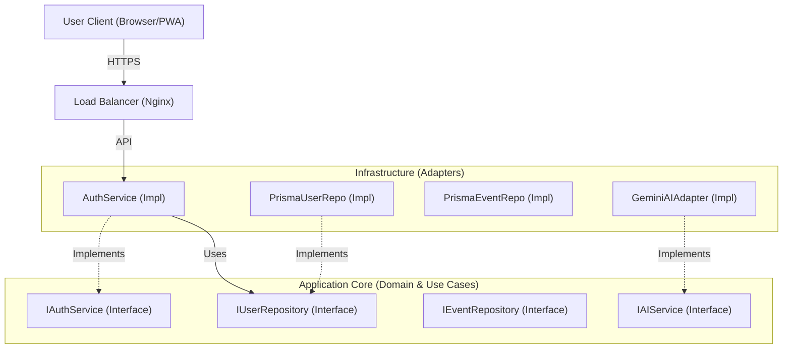

# Event Management System - System Requirements & Architecture Specification

## 1. Executive Summary
This document defines the functional and technical requirements for the Event Management System. It enforces a strict **SOLID** architecture using **NestJS** (Dependency Injection) and **Next.js**, ensuring all components are loosely coupled and testable via precise **Interface** definitions.

---

## 2. Functional Requirements (Features & Solutions)

### Feature 1: User Authentication & Security
**Problem**: The system must verify user identity safely.
- **Solution Req [SOL-AUTH-001]: Restricted Entry**
    - Login page only; no public registration.
- **Solution Req [SOL-AUTH-002]: Credential Management**
    - Passwords hashed via **Argon2id**.
- **Solution Req [SOL-AUTH-003]: Secure Account Recovery**
    - Token-based password reset via email.
- **Solution Req [SOL-AUTH-004]: Modern Auth Protocol**
    - **OAuth 2.0 / OIDC** with **JWT** (Access + Refresh tokens).
    - **Bonus**: MFA via TOTP.

### Feature 2: Event Lifecycle Management
**Problem**: Users need to organize events.
- **Solution Req [SOL-EVENT-001]: Event Entity**
    - Fields: `Title` (Req), `Occurrence` (Req), `Description` (Opt), `OwnerId` (Sys).
- **Solution Req [SOL-EVENT-002]: CRUD Operations**
    - Create, List (Own events), Update (Description only), Delete.
- **Solution Req [SOL-EVENT-003]: Multi-Tenancy**
    - Strict data isolation per user.

### Feature 3: AI-Powered Help Desk
**Problem**: Instant support for users.
- **Solution Req [SOL-HELP-001]: AI Chat**
    - NLP to understand free-text queries.
    - **Automated Workflow**: System must automatically generate AI responses to user messages unless transferred to a human.
- **Solution Req [SOL-HELP-002]: RAG Knowledge Base**
    - Answers based on system documentation.
- **Solution Req [SOL-HELP-003]: Agent Handoff**
    - Escalation to human agents if AI fails/requested.

### Feature 4: Security & Compliance
- **Solution Req [SOL-SEC-001]:** HTTPS (TLS 1.2+) mandatory for all communications.
- **Solution Req [SOL-SEC-002]:** OWASP Top 10 mitigation.
- **Solution Req [SOL-SEC-003]: Centralized Audit Logging**
    - System must log all security-relevant events (Login, Password Reset, Event mutations) to a dedicated audit store.

---

## 3. SOLID Technical Architecture & Interfaces

This section defines the **contracts** (Interfaces) that drive the system, adhering to the **Dependency Inversion Principle (DIP)**. High-level modules (Services) depend on abstractions (Interfaces), not concrete implementations (Repositories/Adapters).

### 3.1 High-Level Architecture
- **Pattern**: Hexagonal / Clean Architecture (Port & Adapters).
- **Core Domain**: Pure TypeScript logic (Entities & Interfaces).
- **Application Layer**: Use Cases (Services).
- **Infrastructure Layer**: Frameworks (NestJS, Prisma, External APIs).

### 3.2 Component Diagram


### 3.3 Domain Interfaces (The Contracts)

#### 3.3.1 Authentication & User Domain
**Principle**: *Interface Segregation*. Separate User management from Auth logic.

```typescript
// Core Entity
export class User {
  constructor(
    public readonly id: string,
    public readonly email: string,
    public readonly passwordHash: string,
    public readonly roles: string[],
  ) {}
}

// Port: Service Interface for verifying identity
export interface IAuthService {
  validateUser(email: string, pass: string): Promise<User | null>;
  login(user: User): Promise<{ accessToken: string; refreshToken: string }>;
  refresh(token: string): Promise<{ accessToken: string }>;
}

// Port: Repository Interface for data persistence
export interface IUserRepository {
  findById(id: string): Promise<User | null>;
  findByEmail(email: string): Promise<User | null>;
  create(user: User): Promise<User>;
  update(user: User): Promise<User>;
}

// Infrastructure: API Controller
@Controller('auth')
export class AuthController {
  @Post('login')
  login(@Body() dto: LoginDto): Promise<Tokens>;
  
  @Post('refresh')
  refresh(@Body() dto: RefreshDto): Promise<AccessToken>;
}
```

#### 3.3.2 Event Domain
**Principle**: *Single Responsibility*. The repository handles data access; the service handles business rules.

```typescript
// Core Entity
export class Event {
  constructor(
    public readonly id: string,
    public readonly ownerId: string,
    public title: string,
    public occurrence: Date,
    public description?: string,
  ) {}
}

// Port: Business Logic
export interface IEventService {
  createEvent(userId: string, title: string, date: Date, desc?: string): Promise<Event>;
  getUserEvents(userId: string): Promise<Event[]>;
  updateDescription(eventId: string, userId: string, newDesc: string): Promise<Event>;
}

// Port: Persistence
export interface IEventRepository {
  save(event: Event): Promise<Event>;
  findManyByOwner(ownerId: string): Promise<Event[]>;
  findById(id: string): Promise<Event | null>;
  delete(id: string): Promise<void>;
}
```

#### 3.3.3 AI Help Desk Domain (Strategy Pattern)
**Principle**: *Open/Closed*. Open for extension (new AI providers), closed for modification (HelpDeskService logic doesn't change).

```typescript
// DTOs
export interface AIChatRequest {
  query: string;
  history: Array<{ role: 'user' | 'model'; content: string }>;
  contextDocuments?: string[]; // RAG Context
}

export interface AIChatResponse {
  text: string;
  sourceReferences?: string[];
}

// Port: The AI Adapter Interface
// Use this to swap between Gemini, OpenAI, or Ollama without breaking the app.
export interface IAIService {
  generateResponse(request: AIChatRequest): Promise<AIChatResponse>;
  embedText(text: string): Promise<number[]>; // For Vector Search
}

// Port: Knowledge Base for RAG
export interface IKnowledgeBaseService {
  findRelevantDocs(query: string): Promise<string[]>;
}
```

---

## 4. Implementation Details (Dependency Injection)

### 4.1 NestJS Module Setup
The application must use NestJS's DI container to bind interfaces to implementations.

```typescript
// app.module.ts (Concept)
@Module({
  imports: [ConfigModule],
  providers: [
    // Bind the abstract 'IoC token' or class to the concrete implementation
    {
      provide: 'IUserRepository', 
      useClass: PrismaUserRepository 
    },
    {
      provide: 'IAIService',
      useClass: GeminiAIAdapter // <-- Selected Strategy
      // useClass: OllamaAIAdapter // <-- Easily swappable
    },
    HelpDeskService // Depends on 'IAIService'
  ]
})
export class AppModule {}
```

### 4.2 The Gemini Adapter Implementation
Specific implementation for the chosen **Strategy A**.

```typescript
// infrastructure/ai/gemini.adapter.ts
@Injectable()
export class GeminiAdapter implements IAIService {
  private model: GenerativeModel;

  constructor(private config: ConfigService) {
    const genAI = new GoogleGenerativeAI(config.get('GEMINI_API_KEY'));
    this.model = genAI.getGenerativeModel({ model: "gemini-1.5-flash" });
  }

  async generateResponse(req: AIChatRequest): Promise<AIChatResponse> {
    // 1. Construct prompt with RAG context
    const prompt = `Context: ${req.contextDocuments?.join('\n')}\n\nUser: ${req.query}`;
    
    // 2. Call Gemini API
    const result = await this.model.generateContent(prompt);
    return { text: result.response.text() };
  }
  
  async embedText(text: string): Promise<number[]> {
     // Implementation for text-embedding-004
  }
}
```

---

## 5. Technical Requirements Checklists

### 5.1 Technology Stack
- **Frontend**: Next.js 14+ (App Router), Tailwind CSS.
- **Backend**: NestJS, TypeScript 5+.
- **Database**: PostgreSQL + Prisma ORM.
- **AI**: Google Gemini 1.5 Flash (Free Tier).

### 5.2 Quality Assurance
- **Unit Testing**: 
    - Services must be tested with **Mocked Repositories** (isolating business logic).
    - Controllers must be tested with **Mocked Services**.
- **E2E Testing**:
    - Test the full flow using a test database container.
- **Code Style**:
    - **Strict**: `noImplicitAny`, `strictPropertyInitialization`.
    - **Prettier**: Single quotes, 2-space indentation.

---

## 6. Frontend Requirements & Architecture

### 6.1 High-Level Frontend Architecture
The frontend must be built as a **Single Page Application (SPA)** using **Next.js 14+** with the **App Router** pattern, ensuring optimal performance, SEO capabilities, and modern React patterns.

#### 6.1.1 Architectural Principles
- **Component-Based Architecture**: Reusable, modular components following atomic design principles.
- **Separation of Concerns**: Clear separation between UI components, business logic, and API communication.
- **Type Safety**: Full TypeScript implementation with strict mode enabled.
- **Performance First**: Code splitting, lazy loading, and optimized bundle sizes.
- **Responsive Design**: Mobile-first approach supporting all device sizes.

### 6.2 Technology Stack
- **Framework**: Next.js 14+ (App Router)
- **Language**: TypeScript 5+
- **Styling**: Tailwind CSS 3+
- **State Management**: React Context API + Custom Hooks OR Zustand for complex state
- **HTTP Client**: Axios or Fetch API with custom interceptors
- **Form Handling**: React Hook Form + Zod validation
- **UI Components**: Custom components or shadcn/ui
- **Icons**: Lucide React or Heroicons
- **Date Handling**: date-fns or Day.js
- **Authentication**: NextAuth.js or custom JWT implementation

### 6.3 Core Features & User Journeys

#### 6.3.1 Authentication & Authorization (Feature 1)
**Requirement**: [FE-AUTH-001] Secure Authentication Flow

**Pages Required**:
1. **Login Page** (`/login`)
   - Email and password input fields with validation
   - Error messaging for invalid credentials
   - "Forgot Password" link
   - No registration option (as per backend requirements)
   - Loading states during authentication
   - Redirect to dashboard on successful login

2. **Password Reset Request** (`/password-reset`)
   - Email input for password reset request
   - Confirmation message after submission
   - Link to return to login page

3. **Password Reset Confirmation** (`/password-reset/[token]`)
   - New password input (with strength indicator)
   - Password confirmation field
   - Token validation feedback
   - Success/error messaging

**Technical Implementation**:
```typescript
// Authentication Service Interface
interface IAuthService {
  login(email: string, password: string): Promise<AuthResponse>;
  logout(): Promise<void>;
  refreshToken(refreshToken: string): Promise<AccessTokenResponse>;
  requestPasswordReset(email: string): Promise<void>;
  resetPassword(token: string, newPassword: string): Promise<void>;
  getCurrentUser(): Promise<User | null>;
}

// Auth Context
interface AuthContextValue {
  user: User | null;
  isAuthenticated: boolean;
  isLoading: boolean;
  login: (email: string, password: string) => Promise<void>;
  logout: () => Promise<void>;
}
```

**Security Requirements**:
- **[FE-SEC-001]**: Store JWT tokens securely (httpOnly cookies preferred, or secure localStorage with XSS protection)
- **[FE-SEC-002]**: Implement automatic token refresh before expiration
- **[FE-SEC-003]**: Clear all sensitive data on logout
- **[FE-SEC-004]**: Implement CSRF protection
- **[FE-SEC-005]**: Validate all inputs client-side before sending to backend

#### 6.3.2 Event Management (Feature 2)
**Requirement**: [FE-EVENT-001] Complete Event CRUD Interface

**Pages Required**:
1. **Dashboard / Events List** (`/dashboard` or `/events`)
   - List all user's events in a table or card grid
   - Sortable columns (Title, Occurrence Date, Created Date)
   - Filter options (Upcoming, Past, All)
   - Search functionality
   - "Create New Event" button
   - Empty state when no events exist
   - Loading skeletons during data fetch
   - Pagination or infinite scroll for large datasets

2. **Create Event** (`/events/new`)
   - Form with validation:
     - Title (required, max 150 chars)
     - Occurrence Date & Time (required, date-time picker)
     - Description (optional, max 5000 chars, rich text editor)
   - Real-time validation feedback
   - Cancel and Save buttons
   - Success notification on creation
   - Redirect to event list on success

3. **Event Details** (`/events/[id]`)
   - Display all event information
   - Edit and Delete action buttons
   - Owner-only actions (guards based on user ID)
   - Confirmation modal before deletion
   - Breadcrumb navigation

4. **Edit Event Description** (`/events/[id]/edit`)
   - Form pre-populated with current description
   - Character counter
   - Save and Cancel buttons
   - Optimistic UI updates

**Component Structure**:
```typescript
// Components needed
- EventList: Main list container
- EventCard: Individual event display
- EventForm: Reusable form for create/edit
- EventDatePicker: Custom date-time picker
- EventActions: Action buttons (Edit, Delete)
- ConfirmDialog: Reusable confirmation modal
```

**State Management**:
```typescript
interface EventState {
  events: Event[];
  selectedEvent: Event | null;
  isLoading: boolean;
  error: string | null;
  filters: {
    searchTerm: string;
    dateRange: [Date, Date] | null;
    sortBy: 'title' | 'occurrence' | 'createdAt';
    sortOrder: 'asc' | 'desc';
  };
}
```

#### 6.3.3 AI-Powered Help Desk (Feature 3)
**Requirement**: [FE-HELP-001] Interactive Help Desk Interface

**Pages Required**:
1. **User Help Desk** (`/help`)
   - Chat interface with message history
   - Message input field (max 2000 chars)
   - Real-time AI response display
   - Loading indicator while AI processes
   - Chat history scrollable view
   - Message timestamps
   - Differentiated styling for user vs AI messages
   - "Escalate to Human Agent" button
   - Persistent chat history (fetched from backend)

2. **Agent Dashboard** (`/help/agent`) - **AGENT/ADMIN Only**
   - Queue of active support requests
   - List of users waiting for human assistance
   - Ability to view user's chat history
   - Interface to send manual replies
   - Notification for new incoming chats
   - Search and filter capabilities
   - User information panel

**Component Structure**:
```typescript
// User Interface Components
- ChatContainer: Main chat wrapper
- MessageList: Scrollable message history
- MessageBubble: Individual message display (user vs AI styling)
- MessageInput: Input field with character counter
- TypingIndicator: Shows when AI is generating response

// Agent Interface Components  
- SupportQueue: List of active support tickets
- ChatWindow: Agent's chat interface with user
- UserInfoPanel: Display user details and event summary
- AgentReplyInput: Text input for agent responses
```

**Real-Time Features**:
- **[FE-HELP-002]**: Implement polling or WebSocket for real-time message updates
- **[FE-HELP-003]**: Display typing indicators
- **[FE-HELP-004]**: Auto-scroll to latest message
- **[FE-HELP-005]**: Notification system for new agent messages

#### 6.3.4 Admin User Management (Feature 4)
**Requirement**: [FE-ADMIN-001] User Provisioning Interface

**Pages Required**:
1. **Admin Dashboard** (`/admin`)
   - Statistics overview (total users, events, support tickets)
   - Quick actions panel

2. **User Management** (`/admin/users`)
   - List all users with their roles
   - Create new user form:
     - Email input (validated)
     - Role selection (USER, AGENT, ADMIN)
     - Generate temporary password display
     - Copy to clipboard functionality
   - Search and filter users
   - User actions (view details, deactivate - if implemented)

**Role-Based Access Control**:
```typescript
// Route Protection
interface RouteGuard {
  allowedRoles: Role[];
  redirectTo: string;
  component: React.ComponentType;
}

// Example usage
const PROTECTED_ROUTES = {
  '/admin': { allowedRoles: ['ADMIN'], redirectTo: '/dashboard' },
  '/help/agent': { allowedRoles: ['AGENT', 'ADMIN'], redirectTo: '/dashboard' },
  '/events': { allowedRoles: ['USER', 'AGENT', 'ADMIN'], redirectTo: '/login' },
};
```

#### 6.3.5 User Account Management
**Requirement**: [FE-USER-001] Self-Service Account Management

**Pages Required**:
1. **Profile/Settings** (`/settings`)
   - Display user information
   - Delete account option with confirmation
   - Clear warning about data deletion
   - Multi-step confirmation process

### 6.4 Routing Architecture

#### 6.4.1 Route Structure
```
/                           → Public landing/redirect to login or dashboard
/login                      → Login page (public)
/password-reset             → Request password reset (public)
/password-reset/[token]     → Reset password with token (public)
/dashboard                  → Main dashboard (protected: USER+)
/events                     → Events list (protected: USER+)
/events/new                 → Create event (protected: USER+)
/events/[id]                → Event details (protected: USER+, owner check)
/events/[id]/edit           → Edit event (protected: USER+, owner check)
/help                       → Help desk user interface (protected: USER+)
/help/agent                 → Agent support dashboard (protected: AGENT+)
/admin                      → Admin dashboard (protected: ADMIN)
/admin/users                → User management (protected: ADMIN)
/settings                   → User settings (protected: USER+)
```

#### 6.4.2 Navigation Components
**Requirement**: [FE-NAV-001] Intuitive Navigation System

**Components**:
1. **Main Navigation Bar**
   - Logo/Brand name
   - Navigation links (role-based visibility):
     - Dashboard
     - Events
     - Help Desk
     - Admin (ADMIN only)
     - Agent Dashboard (AGENT+ only)
   - User menu dropdown:
     - Profile/Settings
     - Logout
   - Responsive mobile menu (hamburger)

2. **Breadcrumb Navigation**
   - Show current location in hierarchy
   - Clickable parent paths
   - Display on all inner pages

3. **Footer**
   - Copyright information
   - Links to documentation
   - System version information

### 6.5 API Integration Layer

#### 6.5.1 HTTP Client Configuration
**Requirement**: [FE-API-001] Centralized API Communication

```typescript
// API Client Structure
class ApiClient {
  private baseURL: string;
  private accessToken: string | null;
  
  constructor() {
    this.baseURL = process.env.NEXT_PUBLIC_API_URL || 'http://localhost:3000';
  }
  
  // Request interceptor
  private async request<T>(config: RequestConfig): Promise<T> {
    // Add auth token
    // Handle errors globally
    // Implement retry logic
    // Refresh token on 401
  }
  
  // Auth endpoints
  auth = {
    login: (data: LoginDto) => this.request('/auth/login', { method: 'POST', data }),
    refresh: (token: string) => this.request('/auth/refresh', { method: 'POST', data: { refreshToken: token } }),
  };
  
  // Event endpoints
  events = {
    list: () => this.request<Event[]>('/events'),
    create: (data: CreateEventDto) => this.request<Event>('/events', { method: 'POST', data }),
    get: (id: string) => this.request<Event>(`/events/${id}`),
    update: (id: string, data: UpdateEventDto) => this.request<Event>(`/events/${id}`, { method: 'PATCH', data }),
    delete: (id: string) => this.request<void>(`/events/${id}`, { method: 'DELETE' }),
  };
  
  // Help desk endpoints
  helpdesk = {
    sendMessage: (content: string) => this.request('/helpdesk/chat', { method: 'POST', data: { content } }),
    getHistory: () => this.request<ChatMessage[]>('/helpdesk/chat/history'),
    getQueue: () => this.request<ChatMessage[]>('/helpdesk/queue'),
    replyToUser: (userId: string, content: string) => this.request(`/helpdesk/chat/${userId}/reply`, { method: 'POST', data: { content } }),
  };
  
  // Admin endpoints
  admin = {
    createUser: (data: AdminCreateUserDto) => this.request('/admin/users', { method: 'POST', data }),
  };
  
  // User endpoints
  users = {
    deleteMe: () => this.request('/users/me', { method: 'DELETE' }),
  };
}
```

#### 6.5.2 Error Handling Strategy
**Requirement**: [FE-API-002] Comprehensive Error Management

```typescript
interface ErrorHandler {
  // HTTP Status specific handlers
  handle401(): void;  // Redirect to login, clear tokens
  handle403(): void;  // Show "Access Denied" message
  handle404(): void;  // Show "Resource not found"
  handle429(): void;  // Show "Too many requests, please wait"
  handle500(): void;  // Show "Server error" message
  
  // Network errors
  handleNetworkError(): void;  // Show "Connection lost"
  handleTimeout(): void;       // Show "Request timed out"
}

// User-facing error messages
const ERROR_MESSAGES = {
  NETWORK_ERROR: 'Unable to connect. Please check your internet connection.',
  UNAUTHORIZED: 'Your session has expired. Please log in again.',
  FORBIDDEN: 'You do not have permission to perform this action.',
  NOT_FOUND: 'The requested resource was not found.',
  RATE_LIMIT: 'Too many requests. Please wait a moment and try again.',
  SERVER_ERROR: 'Something went wrong on our end. Please try again later.',
  VALIDATION_ERROR: 'Please check your input and try again.',
};
```

### 6.6 UI/UX Requirements

#### 6.6.1 Design System
**Requirement**: [FE-UX-001] Consistent Visual Language

**Color Palette**:
- Primary: Brand color for CTAs and key elements
- Secondary: Supporting actions
- Success: #10B981 (green) for success states
- Warning: #F59E0B (amber) for warnings
- Error: #EF4444 (red) for errors and validation
- Neutral: Shades of gray for text and backgrounds

**Typography**:
- Font Family: Inter, system-ui, sans-serif
- Headings: Bold weights (600-700)
- Body: Regular (400) and Medium (500)
- Code/Monospace: For displaying tokens, IDs

**Spacing System**:
- Use Tailwind's spacing scale (0.25rem increments)
- Consistent padding and margins

**Component States**:
- Default
- Hover (interactive feedback)
- Focus (keyboard navigation, accessibility)
- Active (pressed state)
- Disabled (non-interactive state)
- Loading (async operations)

#### 6.6.2 Responsive Design Breakpoints
```typescript
const BREAKPOINTS = {
  sm: '640px',   // Mobile landscape
  md: '768px',   // Tablet portrait
  lg: '1024px',  // Tablet landscape / Desktop
  xl: '1280px',  // Desktop
  '2xl': '1536px' // Large desktop
};

// Mobile-first approach
// Base styles: Mobile
// @media (min-width: md): Tablet adjustments
// @media (min-width: lg): Desktop layout
```

#### 6.6.3 Loading States
**Requirement**: [FE-UX-002] Clear Feedback During Async Operations

- **Page Loading**: Full-page skeleton or spinner
- **Component Loading**: Skeleton screens matching content structure
- **Button Loading**: Spinner in button with disabled state
- **Inline Loading**: Small spinners for inline updates
- **Optimistic Updates**: Immediate UI feedback with rollback on error

#### 6.6.4 Empty States
**Requirement**: [FE-UX-003] Helpful Empty State Design

- **No Events**: Illustration + "Create your first event" CTA
- **No Chat History**: Welcome message with suggested questions
- **No Search Results**: "No matches found" with clear filters option
- **Error States**: Friendly error messages with retry actions

#### 6.6.5 Notifications & Feedback
**Requirement**: [FE-UX-004] Toast Notification System

```typescript
interface Toast {
  id: string;
  type: 'success' | 'error' | 'warning' | 'info';
  title: string;
  message?: string;
  duration?: number; // Auto-dismiss after ms
  action?: {
    label: string;
    onClick: () => void;
  };
}

// Usage examples:
showToast({
  type: 'success',
  title: 'Event created successfully',
  duration: 3000
});

showToast({
  type: 'error',
  title: 'Failed to delete event',
  message: 'Please try again or contact support',
  action: {
    label: 'Retry',
    onClick: () => retryDelete()
  }
});
```

### 6.7 Form Validation Requirements
**Requirement**: [FE-VALID-001] Comprehensive Client-Side Validation

#### 6.7.1 Validation Rules
```typescript
// Login Form
const loginSchema = z.object({
  email: z.string().email('Invalid email address'),
  password: z.string().min(8, 'Password must be at least 8 characters'),
});

// Event Creation Form
const createEventSchema = z.object({
  title: z.string()
    .min(1, 'Title is required')
    .max(150, 'Title must not exceed 150 characters'),
  occurrence: z.date()
    .min(new Date(), 'Event date must be in the future'),
  description: z.string()
    .max(5000, 'Description must not exceed 5000 characters')
    .optional(),
});

// User Provisioning Form
const createUserSchema = z.object({
  email: z.string().email('Invalid email address'),
  roles: z.array(z.enum(['USER', 'AGENT', 'ADMIN']))
    .min(1, 'At least one role is required'),
});

// Chat Message
const chatMessageSchema = z.object({
  content: z.string()
    .min(1, 'Message cannot be empty')
    .max(2000, 'Message must not exceed 2000 characters'),
});
```

#### 6.7.2 Real-Time Validation
- **Inline Validation**: Show errors as user types (debounced)
- **Field-Level Validation**: Validate on blur
- **Form-Level Validation**: Check all fields on submit
- **Clear Error Messages**: User-friendly language, not technical jargon

### 6.8 Accessibility Requirements (WCAG 2.1 Level AA)
**Requirement**: [FE-A11Y-001] Inclusive Design

#### 6.8.1 Keyboard Navigation
- All interactive elements must be keyboard accessible
- Logical tab order
- Visible focus indicators
- Keyboard shortcuts for common actions (optional enhancement)

#### 6.8.2 Screen Reader Support
- Semantic HTML elements (`<nav>`, `<main>`, `<aside>`, `<button>`, etc.)
- ARIA labels where necessary
- Alt text for all images
- Proper heading hierarchy (h1 → h2 → h3)
- Form labels associated with inputs

#### 6.8.3 Visual Accessibility
- Color contrast ratio ≥ 4.5:1 for normal text
- Color contrast ratio ≥ 3:1 for large text
- Don't rely on color alone to convey information
- Resizable text (zoom to 200% without breaking layout)
- Dark mode support (bonus)

#### 6.8.4 Motion & Animation
- Respect `prefers-reduced-motion` media query
- Disable animations for users who prefer reduced motion
- Avoid auto-playing animations

### 6.9 Performance Requirements
**Requirement**: [FE-PERF-001] Optimized User Experience

#### 6.9.1 Core Web Vitals Targets
- **LCP (Largest Contentful Paint)**: < 2.5s
- **FID (First Input Delay)**: < 100ms
- **CLS (Cumulative Layout Shift)**: < 0.1

#### 6.9.2 Optimization Strategies
- **Code Splitting**: Dynamic imports for routes
- **Lazy Loading**: Load components on demand
- **Image Optimization**: Next.js Image component with proper sizing
- **Font Optimization**: Preload critical fonts, use font-display: swap
- **Bundle Size**: Keep total JS < 200KB (gzipped)
- **Caching**: Implement proper cache headers, SWR for data fetching

#### 6.9.3 Network Optimization
- **Request Batching**: Combine multiple API calls where possible
- **Debouncing**: Search inputs, auto-save features
- **Pagination**: Limit initial data load
- **Compression**: Ensure gzip/brotli compression on server

### 6.10 Security Requirements (Frontend-Specific)
**Requirement**: [FE-SEC-006] Client-Side Security Measures

#### 6.10.1 XSS Prevention
- Sanitize all user-generated content before rendering
- Use React's built-in XSS protection (don't use `dangerouslySetInnerHTML` without sanitization)
- Implement Content Security Policy (CSP) headers

#### 6.10.2 Sensitive Data Handling
- Never log sensitive information (tokens, passwords) to console
- Clear sensitive form fields on navigation
- Implement auto-logout after inactivity (15 minutes)
- Mask sensitive information in UI (show only last 4 chars of emails on certain screens)

#### 6.10.3 HTTPS Enforcement
- All API communication must use HTTPS in production
- Redirect HTTP to HTTPS
- Implement Strict-Transport-Security header

#### 6.10.4 Dependency Security
- Regular `npm audit` checks
- Keep dependencies updated
- Avoid using deprecated packages
- Review third-party package permissions

### 6.11 Testing Requirements
**Requirement**: [FE-TEST-001] Comprehensive Frontend Testing

#### 6.11.1 Unit Tests
- **Tool**: Jest + React Testing Library
- **Coverage Target**: > 80%
- **Test Components**: 
  - User interactions (clicks, form submissions)
  - Conditional rendering
  - Props variations
  - Custom hooks

#### 6.11.2 Integration Tests
- **Test API integration layer**
- **Test authentication flow**
- **Test form submissions with validation**
- **Test error scenarios**

#### 6.11.3 E2E Tests
- **Tool**: Playwright or Cypress
- **Critical User Journeys**:
  - User login → create event → logout
  - User login → send help desk message → receive AI response
  - Admin login → create user → verify user can login
  - User login → delete account → verify account deleted

#### 6.11.4 Visual Regression Tests (Optional)
- **Tool**: Chromatic or Percy
- **Test**: Component variations, responsive layouts

### 6.12 Environment Configuration
**Requirement**: [FE-CONFIG-001] Proper Environment Management

```env
# .env.local (Development)
NEXT_PUBLIC_API_URL=http://localhost:3000
NEXT_PUBLIC_APP_NAME=Event Manager
NEXT_PUBLIC_ENVIRONMENT=development

# .env.production
NEXT_PUBLIC_API_URL=https://api.eventmanager.com
NEXT_PUBLIC_APP_NAME=Event Manager
NEXT_PUBLIC_ENVIRONMENT=production
NEXT_PUBLIC_ENABLE_ANALYTICS=true
```

**Configuration Rules**:
- Prefix public variables with `NEXT_PUBLIC_`
- Never commit `.env.local` to version control
- Use `.env.example` to document required variables
- Validate required environment variables on app startup

### 6.13 Documentation Requirements
**Requirement**: [FE-DOC-001] Comprehensive Documentation

#### 6.13.1 Code Documentation
- JSDoc comments for complex functions
- Component prop documentation with TypeScript interfaces
- README.md with setup instructions
- CONTRIBUTING.md with development guidelines

#### 6.13.2 User Documentation
- In-app tooltips for complex features
- Help section with FAQs
- Onboarding tour for new users (optional)

### 6.14 Deployment Requirements
**Requirement**: [FE-DEPLOY-001] Production-Ready Deployment

#### 6.14.1 Build Process
- TypeScript compilation without errors
- ESLint checks pass
- Build optimization enabled
- Environment variables properly configured
- Source maps disabled in production

#### 6.14.2 Hosting Recommendations
- **Vercel**: Native Next.js support, auto-deployments
- **Netlify**: Good Next.js support, CDN distribution
- **AWS Amplify**: Full AWS integration
- **Self-hosted**: Docker container on VPS/cloud provider

#### 6.14.3 CI/CD Pipeline
- Automated testing on pull requests
- Automated builds on merge to main
- Automated deployment to staging environment
- Manual approval for production deployment

### 6.15 Bonus Features Implementation

#### 6.15.1 Multi-Factor Authentication (MFA/TOTP)
**Requirement**: [FE-BONUS-001] MFA Setup and Verification UI

**Pages Required**:
1. **MFA Setup** (`/settings/mfa`)
   - Display QR code for authenticator app
   - Show backup codes
   - Verification input to confirm setup
   
2. **MFA Verification** (`/login/verify`)
   - 6-digit code input
   - "Use backup code" option
   - Error messaging for invalid codes

#### 6.15.2 Voice Interface (Bonus)
**Requirement**: [FE-BONUS-002] Voice-Based Help Desk

**Implementation**:
- Web Speech API for voice input
- Text-to-Speech for AI responses
- Microphone permission handling
- Visual feedback during voice recording
- Fallback to text if voice not supported

### 6.16 Browser Support
**Requirement**: [FE-COMPAT-001] Cross-Browser Compatibility

**Supported Browsers**:
- Chrome/Edge (latest 2 versions)
- Firefox (latest 2 versions)
- Safari (latest 2 versions)
- Mobile browsers (iOS Safari, Chrome Mobile)

**Testing Requirements**:
- Test on all supported browsers
- Implement polyfills for missing features
- Graceful degradation for older browsers
- Display warning for unsupported browsers

---

